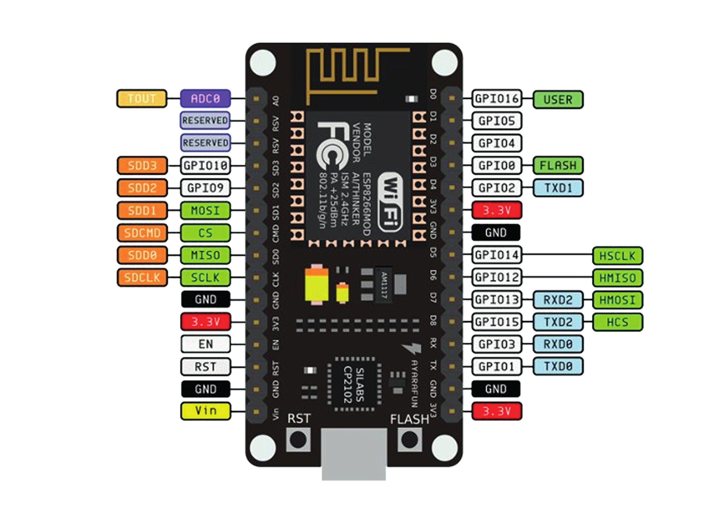
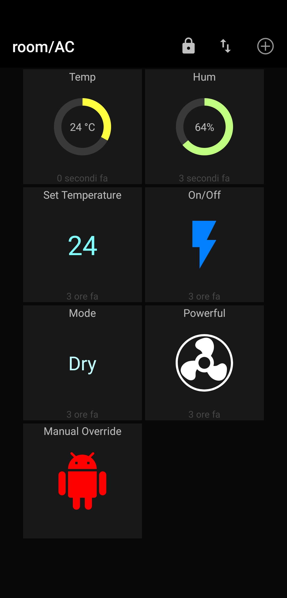

# CoolMCU
Personal project for the Internet of Things course @ Politecnico di Milano, A.Y 2019/2020

## [Small demo video](https://youtu.be/NQHO01V8qtM)

In this video the remote control features are displayed, together with the log screenshot taken from the serial monitor capture.

## [ThingSpeak Channel](https://thingspeak.com/channels/1092202)

## Project concept

The goal was creating a simple sensing and actuating mote that allows me to remotely control the AC unit (so that my room is already at a livable temperature when I get home) and apply to something tangible the skills learned during the course. 

An ESP8266 WiFi board was used to:

* Read the temperature and humidity values in a room
* Send these values to Thingspeak for easy real-time visualization
* Publish these values on a dedicated MQTT topic
* Subscribe to specific MQTT topics for remote control
* Control the AC present in the room via an IR LED and unit-specific IR codes (which can be read using the IRdump examples in the IR LEDs libraries, in my case I found the AC unit codes in a library).

## Hardware

* ESP8266 NodeMCU board
* Breadboard
* Jumpers
* DHT11 (or any temperature and humidity sensor)
* 2N2222 Transistor
* IR LED
* 330 Ohm resistor
* microUSB cable

## Software

* Arduino IDE, [some setup](https://www.instructables.com/id/Setting-Up-the-Arduino-IDE-to-Program-the-ESP8266-/) is needed in order for the board to work with it
* The .ino sketch in this repo
* MQTT client, I used [MQTT Dash](https://play.google.com/store/apps/details?id=net.routix.mqttdash&hl=en_US) for Android

## Build

The board was put on a breadboard together with the DHT11 sensor and the IR LED according to their own pinout.
The IR LED was connected to D2 (Pin 4) through a transistor, in order to guarantee an adequate current flow to power it, and a resistor, to balance the current flow (done after burning 2 IR LEDs).
The DHT11 sensor was connected to D4 (Pin 2) directly.

## Sketch

### setup()

All the services are initialised:

* Serial port for monitoring and debugging
* DHT sensor, to start reading temperature and humidity
* Wifi, to connect to the Internet
* Thingspeak, to send data and visualise it
* MQTT, to receive and send readings
* AC, to control the air conditioning unit

### loop()
It repeats approximately every 5 seconds.
* Temperature and humidity are read and printed to serial port at the beginning of each cycle
* The node checks if the temperature is above 24 and turns the AC on using the dedicated function. There is a manual override boolean in order to allow me to turn it on or off remotely.
* If any message from the control topics has arrived the node sends the command to the AC unit via the IR LED (via the boolean `state_changed`).
* If 2s have passed from the last MQTT messages published, a new one for each value is crafted and published to the channels `/room/temp` and `room/hum` respectively.
* If 30s have passed from the last Thingspeak message (to avoid getting them rejected for being too frequent) another one is sent to [this channel](https://thingspeak.com/channels/1092202).

### MQTT topics
* Publish (from the mote point of view)
  * `/room/temp`, Temperature values
  * `/room/hum`, Humidity values
  * `/room/AC/status`, Current AC remote setup
  * `announcements`, Debug

* Subscribe
  * `room/AC/toggle`, turning on (1) or off (0) the AC unit
  * `room/AC/set_temp`, setting the temperature (number)
  * `room/AC/set_powerful`, toggling the powerful mode (1 or 0)
  * `room/AC/set_mode`, Heat (`h`), Cool (`c`), Dry (`d`), Auto (`a`) mode
  * `room/AC/room/AC/manual_or`, toggling the manual override (1 or 0)
  * `room/AC/reset_AC`, reset the remote to the default setting

Between parenthesis there are the payloads the node is able to recognise and convert into a IR remote command for the AC unit.

## Dashboard
The dashboard on MQTT Dash allows me to monitor the temperature and control the AC unit remotely.

## Dependencies
* Sensor:
  * `<DHT.h>` Temperature and humidity sensor library

* WiFi:
  * `<ESP8266WiFi.h>`
  * `<WiFiClient.h>`

* ThingSpeak:
  * `<ThingSpeak.h>`

* MQTT:
  * `<PubSubClient.h>`

* Remote control:
  * `<Arduino.h>`
  * `<IRremoteESP8266.h>`
  * `<IRsend.h>`
  * `<ir_Panasonic.h>` Model specific library

## Improvements

* Google Assistant integration
